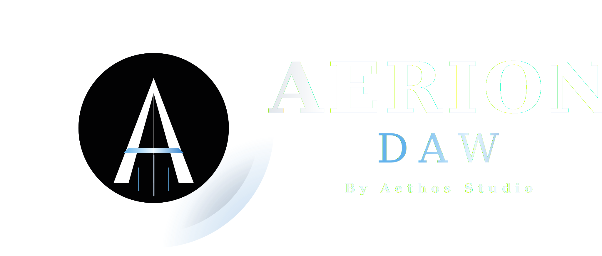

<div align="center">
  


  A professional-grade, native Digital Audio Workstation built with C++20, JUCE 8, and the Tracktion Engine.
</div>

---

## Project Overview

Aerion DAW is a native C++ application targeting zero-latency real-time audio,
a lock-free threading model, and modern MIDI 2.0 / MPE workflows. The codebase
follows a strict Model-View-Controller layout: state lives in
`juce::ValueTree` structures, the audio graph is owned by a Tracktion `Edit`,
and the UI is composed of native JUCE components.

### Key Technologies
- **Framework:** [JUCE 8](https://juce.com/)
- **Audio Engine:** [Tracktion Engine](https://www.tracktion.com/develop/tracktion-engine) (v3.2)
- **Build System:** CMake 3.20+
- **Language:** C++20
- **Cloud Sync:** Google Drive (OAuth 2.0 + PKCE)

## System Requirements

| Requirement | Minimum | Recommended |
| :--- | :--- | :--- |
| **OS** | Windows 10 (64-bit) | Windows 11 (64-bit) |
| **CPU** | Intel Core i5 / AMD Ryzen 5 | Intel Core i7 / AMD Ryzen 7 |
| **RAM** | 4 GB | 8 GB or 16 GB |
| **Graphics** | OpenGL 3.2 compatible | Dedicated GPU / High-res display |
| **Audio** | Windows Audio / ASIO4ALL | Dedicated Audio Interface (ASIO) |
| **Storage** | 200 MB (Installation) | 1 GB+ SSD (Projects & Caching) |

## Repository Layout

```
AerionDawCpp/
  CMakeLists.txt
  Resources/
    logo.svg
    aethos_logo.svg            Standalone company logo (Celtic Metal aesthetic)
  Source/
    Main.cpp                  JUCE application entry point
    MainComponent.{h,cpp}     Top-level window layout
    UIComponents.h            TopPanel, Sidebar, Browser, Timeline, Mixer, Transport
    LogoComponent.h           Celtic Metal logo rendering
    ProjectData.{h,cpp}       ValueTree-backed project model
    AudioEngine.{h,cpp}       Tracktion Engine + transport wrapper
    GoogleDriveClient.{h,cpp} OAuth/PKCE login, Drive multipart upload, file listing
    AIManager.{h,cpp}         Audio-to-MIDI transcription scaffolding (ONNX-bound)
modules/
  juce/                       JUCE submodule (also fetched via FetchContent)
```

## Getting Started

### Prerequisites
- **CMake** 3.20 or higher
- A C++20-capable compiler (MSVC 2022, Clang, or GCC)
- **Git** — Tracktion Engine and JUCE are pulled in via `FetchContent`

### Building

```bash
cd AerionDawCpp
cmake -B build
cmake --build build --config Debug --target AerionDaw
```

The resulting executable is written to:
```
AerionDawCpp/build/AerionDaw_artefacts/Debug/Aerion DAW.exe
```

> The first configure pulls Tracktion Engine + JUCE (~several minutes). Subsequent builds are incremental.

## Architecture

Strict **Model-View-Controller** separation:

- **Model** — `ProjectData` owns the project `juce::ValueTree`. All UI state
  (tracks, regions, mixer levels, sends) is queried and mutated through the
  tree, giving thread-safe, undoable, observable state out of the box.
- **View** — JUCE `Component`s in `UIComponents.h`. The top-level
  `MainComponent` lays them out via bounds logic; each panel paints itself
  from the `ValueTree` it observes.
- **Controller** — `AudioEngineManager` wraps the Tracktion `Edit` and
  transport. UI controls (e.g. `Transport`'s play/stop buttons) call directly
  into it.

### Google Drive Integration

`GoogleDriveClient` implements the desktop OAuth 2.0 flow with PKCE:

1. Generates a 64-byte random `code_verifier` and its `S256` `code_challenge`.
2. Launches the system browser at the Google authorization endpoint.
3. Spins up a local listener on `http://localhost:8080` to capture the redirect.
4. Exchanges the auth code for access + refresh tokens at the token endpoint.
5. Persists tokens to `<userAppData>/AerionDaw/drive_tokens.json` so logins
   survive across launches.

Once authenticated, the client supports:

- `saveProject(juce::File)` — `multipart/related` upload of project bytes +
  metadata to `drive.googleapis.com/upload/drive/v3/files`.
- `listAudioFiles()` — Drive v3 file listing filtered by `mimeType contains 'audio/'`,
  delivered to `onFilesListed` on the message thread.
- `refreshAccessToken()` — exchanges the stored refresh token for a fresh
  access token.

Login state changes propagate through `onLoginStateChanged(bool)`; the
`TopPanel` button uses this to swap between **Login to Google Drive** and
**Disconnect Drive**.

> To use Drive sync, plug your own OAuth Desktop client credentials into
> `GoogleDriveClient::clientId` / `clientSecret`.

### AI / Audio-to-MIDI

`AIManager` is the integration point for a transcription model (intended to
run via ONNX Runtime). Today it provides the threading + Tracktion scaffolding
with a mocked transcription so the UI flow can be exercised end-to-end. The
ONNX dependency is declared in `CMakeLists.txt` but not built from source — a
prebuilt ONNX Runtime should be linked in for production use.

## Code Signing (Windows)

To prevent anti-virus programs from flagging the DAW as malicious, you should digitally sign the executable and the installer.

1. **Obtain a Certificate:** You need a Windows Code Signing Certificate (usually a `.pfx` file).
2. **Use SignTool:** This tool is included in the Windows SDK.
3. **Run the Command:**
   ```powershell
   signtool sign /f "path/to/your/certificate.pfx" /p "your_password" /tr http://timestamp.digicert.com /td sha256 /fd sha256 "Aerion DAW.exe"
   ```
4. **Sign the Installer:** Don't forget to also sign the generated installer `.exe`.

## License

This project is licensed under the terms found in the `LICENSE` file.
