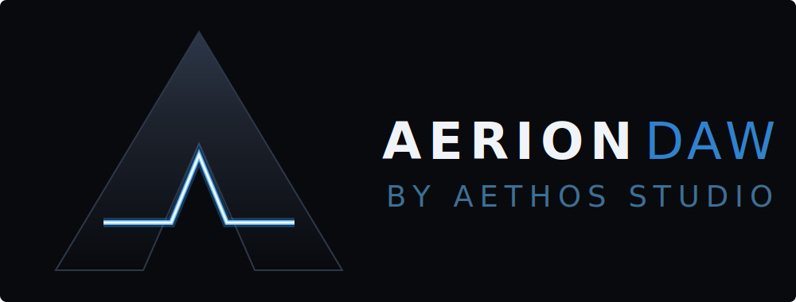

<div align="center">
  

  **A modern Digital Audio Workstation built with C++20, JUCE 8, and the Tracktion Engine.**
</div>

---

## Current Status: v0.1.0 (pre-Alpha)

Aerion DAW is currently in its pre-alpha development stage. **Milestone 1 (Core Foundation)** is fully complete, and we are deep into **Milestone 2 (Advanced Workflows & Cloud Sync)**. 

The application is stable on Windows 11 and features a high-performance audio engine with advanced UI capabilities already implemented.

---

## Why Aerion DAW?

Aerion is designed to bridge the gap between high-end professional production and modern, cloud-connected workflows.

*   **⚡ Native Performance:** Built in C++20 with JUCE 8 and the Tracktion Engine for rock-solid, low-latency audio processing.
*   **🎨 High-Polish UI:** Features a unique "Celtic Metal" dark theme, animated splash screens, and Studio One-style position-aware drag-and-drop.
*   **🤖 AI-Ready:** Foundation laid for future AI-enhanced workflows including audio-to-MIDI transcription and stem separation.

---

## Key Features

| Area | Features |
| :--- | :--- |
| **Audio Engine** | Multi-track audio/folder support, automation lanes (vol/pan), 24-bit/32-bit float support, and VST3/AU plugin hosting. |
| **Timeline** | Studio One-style drag & drop with ghost previews, multi-file consecutive placement, and grid-snapping clip editing. |
| **Piano Roll** | Comprehensive MIDI editor with note quantization, snap-to-grid, and high-performance scrolling. |
| **Cloud Sync** | Integrated Google Drive client for OAuth2/PKCE login and background file synchronization. |
| **Mixer** | Real-time level meters, detachable mixer window, and per-track fader/pan control with branded JUCE-rendered windowing. |
| **Browser** | Waveform previews for local files, plugin category browsing, and a dedicated "Cloud" tab for remote projects. |
| **Branding** | Custom "Spectre from the fog" animated splash screen and full Celtic Metal dark theme throughout. |

---

## Repository Layout

```
AerionDawCpp/
  CMakeLists.txt
  Resources/         SVG assets, custom typefaces (Cinzel), and icons.
  Source/
    Main.cpp         Application entry point and splash window lifecycle.
    MainComponent/   Root layout and panel management.
    AudioEngine/     Core Tracktion Engine wrapping and transport.
    UIComponents/    The entire native JUCE UI (Timeline, Mixer, Browser, etc.).
    ProjectData/     ValueTree-backed project model (The "Truth").
    GoogleDrive/     Cloud client and OAuth flow.
    AI/              Scaffolding for ONNX-bound AI tasks.
```

---

## System Requirements

| Requirement | Minimum | Recommended |
| :--- | :--- | :--- |
| **OS** | Windows 10 (64-bit) | Windows 11 (64-bit) |
| **CPU** | Intel Core i5 / AMD Ryzen 5 | Intel Core i7 / AMD Ryzen 7 |
| **RAM** | 4 GB | 16 GB |
| **Graphics** | OpenGL 3.2 compatible | Dedicated GPU |
| **Audio** | Windows Audio / ASIO4ALL | Dedicated ASIO Audio Interface |

---

## Getting Started

### Prerequisites
- **CMake** 3.20+
- **Visual Studio 2022** (MSVC)
- **PowerShell 7** (for build scripts)

### Building (Windows/PowerShell)

```powershell
# Configure
cmake -S . -B build -G "Visual Studio 17 2022" -A x64

# Build
cmake --build build --config Debug
```

The executable will be located at:
`.\build\AerionDaw_artefacts\Debug\Aerion DAW.exe`

---

## Architecture

Aerion DAW follows a strict **Model-View-Controller (MVC)** separation:

*   **Model:** `ProjectData` owns the project `juce::ValueTree`, which acts as the single source of truth for the project state.
*   **Controller:** `AudioEngineManager` wraps the Tracktion `Edit` and manages the real-time audio graph and transport.
*   **View:** Native JUCE components in `UIComponents.h` observe the `ValueTree` and repaint only when the underlying state changes.

---

## License

This project is licensed under the terms found in the `LICENSE` file.
