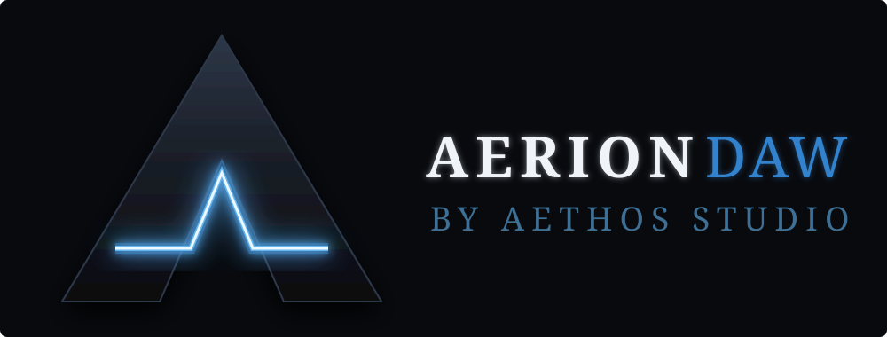

<p align="center">
  
</p>

**A modern Digital Audio Workstation built with C++20, JUCE 8, and the Tracktion Engine.**

**Development status:** v0.3.0 Pre-Alpha — Milestones 1–4 complete; Milestone 5 (Polish & Stability) in progress. See [`AerionDawCpp/Documentation/ROADMAP.md`](AerionDawCpp/Documentation/ROADMAP.md) and [`STATUS.md`](AerionDawCpp/Documentation/STATUS.md).

---

## Why Aerion DAW?

Aerion is designed to bridge the gap between high-end professional production and modern, cloud-connected workflows.

- **⚡ Native Performance:** Built in C++20 with JUCE 8 and the Tracktion Engine for rock-solid, low-latency audio processing.
- **🎨 High-Polish UI:** Features a unique dark theme, animated splash screens, and Studio One-style position-aware drag-and-drop.
- **🤖 AI-Ready:** Foundation laid for future AI-enhanced workflows including audio-to-MIDI transcription and stem separation.

---

## Key Features


| Area             | Features                                                                                                               |
| ---------------- | ---------------------------------------------------------------------------------------------------------------------- |
| **Audio Engine** | Multi-track audio/folder support, automation lanes (vol/pan), 24-bit/32-bit float support, and VST3/AU plugin hosting. |
| **Timeline**     | Studio One-style drag & drop with ghost previews, multi-file consecutive placement, and grid-snapping clip editing.    |
| **Piano Roll**   | Comprehensive MIDI editor with note quantization, snap-to-grid, and high-performance scrolling.                        |                             |
| **Mixer**        | Real-time level meters, detachable mixer window, and per-track fader/pan control with branded JUCE-rendered windowing. |
| **Browser**      | Waveform previews for local files, plugin category browsing, and a dedicated "Cloud" tab for remote projects.          |
| **Export**       | Professional audio mixdown to WAV/AIFF/FLAC/OGG with bounds selection, format presets, wildcard templates, waveform display with clip detection (Reaper-style), and configurable sample rates/channels. |

---

## Recent Updates

- **Milestone 5 kick-off:** CI build-on-PR workflow (`build-test.yml`) and first smoke tests (`AerionTests`).
- **Milestone 4 complete:** Custom keyboard shortcuts, time signature changes, per-track input/monitor persistence, mixdown + stems export, freeze/bounce, crash recovery.
- **Docs & versioning:** Roadmap/STATUS aligned to v0.3.0; window title bar shows `<ProjectName> — Aerion DAW` on startup; About dialog reads the CMake app version.

---

## Repository layout

Only the items needed to build and ship the app are tracked. Everything else (IDE caches, AI tooling folders, build output, installers, scratch notes) is gitignored so the repo root stays minimal.

```
Aerion-DAW/
  README.md            This file (the only loose markdown at the root)
  LICENSE              GPLv3
  .gitignore
  .github/             CI workflows and community docs (Code of Conduct)
  AerionDawCpp/        CMake project, C++ sources, assets, bundled docs
    CMakeLists.txt
    CMakePresets.json  Windows CMake presets (optional)
    CMake/             CPack helper scripts
    Documentation/     Roadmap, status, release notes, manual test checklist, Cursor dev guide (Windows)
    Resources/         SVG assets, fonts, icons
    External/          Third-party SDKs (e.g. Steinberg ASIO on Windows)
    Source/            Application code (Main, AudioEngine, UI, Export, …)
```

Anything else you see locally (e.g. `build/`, `dist/`, `_CPack_Packages/`, `.cursor/`, `.claude/`, `Cursor-AI/`, `Gemini/`, `.vs/`, etc.) is **gitignored** — see `.gitignore` for the full list.

---

## System Requirements


| Requirement  | Minimum                     | Recommended                    |
| ------------ | --------------------------- | ------------------------------ |
| **OS**       | Windows 10 (64-bit)         | Windows 11 (64-bit)            |
| **CPU**      | Intel Core i5 / AMD Ryzen 5 | Intel Core i7 / AMD Ryzen 7    |
| **RAM**      | 4 GB                        | 16 GB                          |
| **Graphics** | OpenGL 3.2 compatible       | Dedicated GPU                  |
| **Audio**    | Windows Audio / ASIO4ALL    | Dedicated ASIO Audio Interface |


---

## Getting Started

### Prerequisites

- **CMake** 3.20+
- **Visual Studio 2022** (MSVC, x64 — workload *Desktop development with C++*)
- **Git** (Tracktion Engine is fetched on first configure)
- **PowerShell 7** (optional; Windows PowerShell also works)

Open the **repository root** in Cursor/VS Code — root `CMakePresets.json` includes the Aerion presets and `.vscode/settings.json` points CMake Tools at `AerionDawCpp/`. See [`AerionDawCpp/Documentation/CURSOR_DEVELOPMENT.md`](AerionDawCpp/Documentation/CURSOR_DEVELOPMENT.md) for the full Windows dev guide.

### Building (Windows / PowerShell)

From the **repository root**:

```powershell
# Configure + build (Debug)
cmake --preset win-msvc-debug -S AerionDawCpp -B build
cmake --build build --preset win-msvc-debug

# Release
cmake --build build --preset win-msvc-release

# Smoke tests (optional)
cmake --preset win-msvc-debug-tests -S AerionDawCpp -B build
cmake --build build --preset win-msvc-debug-tests
ctest --test-dir build -C Debug --output-on-failure

# ---- Manual alternative ----
cmake -S AerionDawCpp -B build -G "Visual Studio 17 2022" -A x64
cmake --build build --config Debug --target AerionDaw
```

The executable is written to:

`build\AerionDaw_artefacts\Debug\Aerion DAW.exe` (or `Release` when you build that configuration).

---

## Architecture

Aerion DAW follows a strict **Model-View-Controller (MVC)** separation:

- **Model:** `ProjectData` owns the project `juce::ValueTree`, which acts as the single source of truth for the project state.
- **Controller:** `AudioEngineManager` wraps the Tracktion `Edit` and manages the real-time audio graph and transport.
- **View:** Native JUCE components in `UIComponents.h` observe the `ValueTree` and repaint only when the underlying state changes.

See `AerionDawCpp/Documentation/` for the roadmap, status, release procedure, manual test checklist, and [`CURSOR_DEVELOPMENT.md`](AerionDawCpp/Documentation/CURSOR_DEVELOPMENT.md) (Windows build + Cursor guardrails).

---

## License

This project is licensed under the terms found in the `LICENSE` file.
