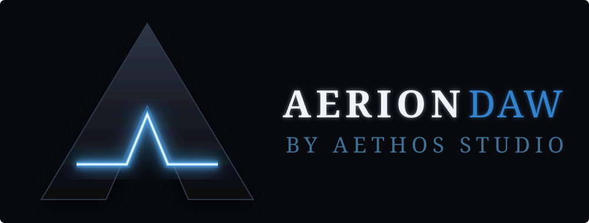

<p align="center">
  
</p>

**Aerion DAW** is a native digital audio workstation built in **C++20** with **JUCE 8** and the **Tracktion Engine v3.2**. It targets serious home and project-studio production on **Windows 11** first, with **macOS** builds supported through CI and release packaging.

**Current version:** v0.5.0 Alpha · **Active milestone:** [M6 — Complete Core](AerionDawCpp/Documentation/ROADMAP.md) · **[User Manual](Aerion-DAW-Manual.html)**

[](https://github.com/aethos-studio/Aerion-DAW/actions/workflows/build-test.yml)

---

## What Aerion is today

Aerion is a **working alpha DAW**, not a demo shell. You can record, edit, mix, and export a complete song session on Windows today. Milestones 1–5 — editing, mixing, recording, project workflow, and polish & stability — are complete. Milestone 6 fills the remaining gaps to a modern DAW baseline: full automation, time-stretch, sidechain and controller mapping. Aerion works with your own instrument and effect plugins; it doesn't ship built-in ones.

The long-term vision includes AI-assisted workflows and cloud project sync, but those are **scaffolding only** right now. The current focus is making the core DAW fast, stable, and trustworthy.

---

## What you can do

### Arrange and edit

- Multi-track **audio**, **MIDI**, and **folder** tracks with free reordering and submix folders
- **Position-aware drag-and-drop**: ghost previews, grid snap, consecutive multi-file import
- Clip trim, split, move, nudge, fades, comps, loop regions, and markers
- **Piano roll** with note editing, velocity lane, MIDI CC / pitch-bend lanes, quantize, and snap
- **Tempo map** and **time signature** changes on the timeline ruler
- **Automation** lanes for volume and pan

### Record

- Per-track **record arm**, input routing, and monitor modes (Auto / On / Off)
- **ASIO**, WASAPI, and DirectSound on Windows; CoreAudio on macOS
- Metronome, count-in, punch in/out, plugin delay compensation
- Live recording waveform that grows under the playhead

### Mix

- Real-time level meters, faders, pan, mute, and solo
- **Detachable mixer** window and per-track inspector
- Phase invert, mono sum, HPF/LPF quick filters
- Serial **insert** chain with bypass and drag-to-reorder
- **Sends** to buses and mix **snapshots**
- **VST3** plugin hosting (Windows and macOS) and **Audio Units** (macOS)

### Project and export

- Save and load **`.aerion`** project files with full round-trip state
- Collect & save, auto-save, and crash recovery
- **Plugin crash protection** (Windows): a plugin that crashes while processing audio, loading, saving or restoring its settings, or opening its editor is caught and switched off, and the session keeps going; plugin scanning runs in a separate process
- **Accessibility**: screen-reader labels and keyboard control for the Mixer, Transport, Toolbar, Inspector and track headers (F6 moves between panes)
- **Freeze / bounce** tracks; mixdown and **stems** export to WAV / AIFF / FLAC / OGG
- Customisable **keyboard shortcuts** (`.aerionkeys` import/export)
- **Workspace layouts** — built-in Editing / Mixing / Recording presets plus saved custom layouts

---

## Platforms

| Platform | Status |
|---|---|
| **Windows 11 / 10 (x64)** | Primary development and daily-use target. Visual Studio 2022 + MSVC. |
| **macOS** | Secondary. Built and packaged via GitHub Actions (universal ARM64 + Intel DMG). |
| **Linux** | Not a supported product target. Engine code has ALSA/JACK hooks via JUCE, but there is no Linux installer or CI preset on `main`. |

---

## Shipped milestones

**Milestone 1 — Editing (v0.0.1).** Trim, split, move and nudge clips; clip gain and fade handles; record takes and comp them; loop range and markers; snap to grid; in the Piano Roll, quantize, a velocity lane and MIDI CC / pitch-bend lanes.

**Milestone 2 — Mixing (v0.1).** Phase invert, mono sum and high-pass / low-pass quick filters per track; clip indicators and a K-14 meter scale on the master; folder tracks that can be submix buses, with mute and solo passing down to their tracks; sends to new buses; an insert chain with bypass and drag-to-reorder; mix snapshots.

**Milestone 3 — Recording & Monitoring (v0.2).** Monitor modes (Auto / On / Off); an audio input and a MIDI controller per track; plugin delay compensation; count-in, metronome with level and accented downbeat; punch in/out; a live waveform while recording; ASIO, WASAPI, DirectSound and Core Audio, with a one-click reset of the audio settings.

**Milestone 4 — Project & Workflow (v0.3).** Projects saved as one `.aerion` file, Collect & Save, freeze; mixdown and stem export to WAV / AIFF / FLAC / OGG with a preview, presets and file-name wildcards; tempo map and time-signature changes on the ruler; customisable keyboard shortcuts; recent projects; auto-save and crash recovery.

**Milestone 5 — Polish & Stability (v0.4).** A fast interface (every measured repaint fits a 60 Hz frame at 1080p) and a lean audio engine (4.6 % of a 128-sample block at the 99th percentile for 32 tracks); UI scaling up to 200 %; resizable tracks; plugin crash protection on Windows and out-of-process plugin scanning; screen-reader and keyboard access; a log console and local crash reports; workspace layouts; CI on Windows and macOS and signed-when-possible installers. Numbers in [`PERFORMANCE.md`](AerionDawCpp/Documentation/PERFORMANCE.md).

What comes next is in the [roadmap](AerionDawCpp/Documentation/ROADMAP.md).

---

## Recent progress (October 2026)

**v0.5.0 Alpha** is the first public release. The last days before it added:

- **Updates from inside Aerion** — Aerion checks GitHub for a newer release, shows what changed, downloads the installer, checks its checksum and installs it; **Help → Check for Updates** checks on demand
- **Follow Playback** — **Transport → Follow Playback**, the toolbar button or **F** keeps the playhead in view while the song plays
- **At home on a Mac** — menus in the menu bar at the top of the screen, Command shortcuts and the Mac Delete key, the native title bar, and trackpad gestures (two-finger scrolling and pinch zoom, also on Windows precision touchpads)
- **Installer** — waits for a running Aerion to close instead of failing; the Windows installer is signed with a certificate kept in Keeper
- **Piano Roll** — stays fast with thousands of notes selected (63 ms → 7 ms per repaint)
- **User manual** — [`Aerion-DAW-Manual.html`](Aerion-DAW-Manual.html), built into the app; **Help → User Manual** opens it in your browser

---

## Known limits

| Area | State |
|---|---|
| Performance | UI and audio targets met; numbers in [`PERFORMANCE.md`](AerionDawCpp/Documentation/PERFORMANCE.md) |
| Plugin crash protection | Windows catches crashes while processing, loading, saving, restoring and opening editors. Crashes inside an open editor, and all plugin crashes on macOS, need out-of-process plugin hosting (planned for Milestone 8) |
| Error reporting | Done: the app log shows in a **Console** bottom-panel tab; a crash writes a local report (stack, log, Windows minidump) that the next launch points to |
| High-DPI / UI scaling | Done: **View → UI Size** (Auto / 100–200 %) scales the whole interface; the Timeline stays fast and sharp on scaled displays |
| Track heights | Done: drag a track's bottom edge (or use Track Height in its context menu); saved per track |
| Tests | Smoke tests for `ProjectData`, `AerionKeymap`, `AudioEngineManager` (incl. plugin settings and track heights through save and load, automation override), graphics engine choice, UI size, plugin fault handling (processing and saving) and dialogs; `AerionBench --verify` (pixel checks, fader drags, accessibility) runs in CI at 100 % and 125 % UI size and passed on Windows and macOS for v0.4.0; `AerionBench --audio` measures the audio side |
| Packaging | Windows NSIS and macOS DMG; production signing and notarization wait on paid certificates (the workflow runs them once the secrets are added) |
| Accessibility | Mixer, Transport, Toolbar, Inspector and track headers; Timeline clips and Piano Roll notes not yet |
| AI / Cloud | `AIManager` is a mock; Google Drive client has placeholder OAuth credentials |

See [`ROADMAP.md`](AerionDawCpp/Documentation/ROADMAP.md) for what's coming and [`STATUS.md`](AerionDawCpp/Documentation/STATUS.md) for the detailed status.

---

## Getting started (Windows)

### Prerequisites

- **CMake** 3.20+
- **Visual Studio 2022** with the *Desktop development with C++* workload (MSVC, x64)
- **Git** (Tracktion Engine is fetched on first configure, and Aerion's small engine patches in `AerionDawCpp/Patches/` are applied with `git apply`)

Open the **repository root** in your editor. Root `CMakePresets.json` includes the Aerion presets; `.vscode/settings.json` points CMake Tools at `AerionDawCpp/`.

### Build

From the repository root in **PowerShell**:

```powershell
# Configure + build (Debug)
cmake --preset win-msvc-debug -S AerionDawCpp -B build
cmake --build build --preset win-msvc-debug

# Release
cmake --build build --preset win-msvc-release

# Smoke tests
cmake --preset win-msvc-debug-tests -S AerionDawCpp -B build
cmake --build build --preset win-msvc-debug-tests
ctest --test-dir build -C Debug --output-on-failure
```

If a full build fails in one of Tracktion's example programs, build only Aerion's targets:

```powershell
cmake --build build --config Debug --target AerionDaw AerionTests --parallel
```

The app binary:

```text
build\AerionDaw_artefacts\Debug\Aerion DAW.exe
```

For profiling builds, release packaging, and the paint benchmark, see [`CURSOR_DEVELOPMENT.md`](AerionDawCpp/Documentation/CURSOR_DEVELOPMENT.md).

### CI and releases

Both GitHub Actions workflows are **manual only** (`workflow_dispatch`):

- **build-test** — Debug build + smoke tests on Windows and macOS
- **release-package** — Windows NSIS installer and macOS DMG published to a GitHub Release, signed and notarized when the signing secrets are set (see the release section of [`CURSOR_DEVELOPMENT.md`](AerionDawCpp/Documentation/CURSOR_DEVELOPMENT.md))

Run them from the [Actions tab](https://github.com/aethos-studio/Aerion-DAW/actions).

---

## Architecture

Aerion follows strict **Model–View–Controller** separation:

| Layer | Component | Role |
|---|---|---|
| Model | `ProjectData` | `juce::ValueTree` is the single source of truth for project state |
| Controller | `AudioEngineManager` | Wraps the Tracktion `Edit`, transport, and real-time audio graph |
| View | JUCE components | Observe the ValueTree; UI repaints when state changes |

Application code lives under `AerionDawCpp/Source/`. Each UI view (Timeline, Mixer, Piano Roll, Inspector, Browser, Transport, menu bar, toolbar, dialogs) has its own header in `Source/Views/`; `UIComponents.h` includes them all. Shared drawing code (theme, icons, cached layers, dialogs) is in `Source/UI/`.

Aerion carries a few small patches to Tracktion Engine in `AerionDawCpp/Patches/` (currently one: a hook around each hosted plugin's `processBlock`, used for plugin crash protection). CMake applies them at configure time.

---

## Repository layout

```text
Aerion-DAW/
  README.md                 This file
  LICENSE                   GPLv3
  CMakePresets.json         Includes AerionDawCpp presets
  .github/                  CI workflows
  AerionDawCpp/             CMake project root
    Source/                 Application code
      Views/                One header per UI view
      UI/                   Theme, icons, cached layers, dialogs
      Tests/                Smoke tests and the AerionBench paint benchmark
    Patches/                Aerion's patches to Tracktion Engine
    CMake/                  CMake helpers (patch application, packaging)
    Resources/              Icons, fonts, SVG assets
    External/               Third-party SDKs (e.g. Steinberg ASIO on Windows)
    Documentation/          Roadmap, status, dev guides
    Tools/                  Dev helper scripts
```

Build output (`build/`), IDE caches, and local scratch folders are gitignored.

---

## System requirements

| | Minimum | Recommended |
|---|---|---|
| **OS** | Windows 10 (64-bit) | Windows 11 (64-bit) |
| **CPU** | Intel Core i5 / AMD Ryzen 5 | Intel Core i7 / AMD Ryzen 7 |
| **RAM** | 4 GB | 16 GB |
| **Graphics** | OpenGL 3.2 compatible | Dedicated GPU |
| **Audio** | Windows Audio / ASIO4ALL | Dedicated ASIO interface |

---

## License

This project is licensed under the terms in [`LICENSE`](LICENSE).

**Trademarks:** ASIO is a trademark of Steinberg Media Technologies GmbH. JUCE is a trademark of Raw Material Software Limited. VST is a trademark of Steinberg Media Technologies GmbH. Aerion uses VST3 plugin hosting only.
